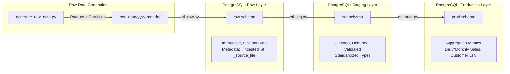

# Week 03-04: 3-Layer ETL Implementation Walkthrough

## 1. Architecture Overview

We have implemented a robust 3-layer ETL architecture:



## 2. Technical Stack Improvements

- **Database Connector**: Refactored to use **SQLAlchemy** (replacing `psycopg2`).
  - **Why?** Better connection pooling, full Pandas compatibility, and handles large batch inserts more reliably.
- **Data Format**: Used **Parquet** for raw data storage (efficient compression and type preservation).
- **Orchestration**: `etl_runner.py` manages the dependency chain (Raw -> Stg -> Prod).

## 3. Project Structure

```
week-03-04-python-etl/
├── raw_data/                  # Generated Parquet files (partitioned by date)
├── scripts/
│   ├── generate_raw_data.py   # Data generator with intentional errors
│   ├── db_connector.py        # SQLAlchemy database wrapper
│   ├── etl_raw.py             # Layer 1: Ingestion
│   ├── etl_stg.py             # Layer 2: Cleaning & Validation
│   ├── etl_prod.py            # Layer 3: Aggregation
│   └── etl_runner.py          # Pipeline Orchestrator
└── sql/
    └── 04-create-etl-tables.sql # DDL for all 3 schemas
```

## 4. How to Run

All commands are integrated into the `Makefile` for ease of use.

### Step 1: Initialize Database
Creates the `raw`, `staging`, and `prod` schemas and tables.
```bash
make etl-setup-schema
```

### Step 2: Generate Data
Generates synthetic data for the year 2025 with intentional "dirty" data (duplicates, nulls, casing issues) to simulate real-world scenarios.
```bash
make etl-generate-raw
```
*(For a quick test, use `make etl-generate-raw-test` to generate just 3 days)*

### Step 3: Run ETL Pipeline
Runs the full sequence: Ingest -> Clean -> Aggregate.
```bash
make etl-run-all
```

## 5. Metadata & Data Quality Features

- **Raw Layer**: 
  - Preserves original data exactly as received.
  - Adds `_partition_date` and `_source_file` for lineage.
- **Staging Layer**:
  - **Capitalization**: Standardizes customer and product names.
  - **Deduplication**: Removes duplicate records inserted in raw.
  - **Validation**: Filters out invalid emails and negative amounts.
- **Production Layer**:
  - **Daily Sales**: Aggregates revenue, items, and orders by day.
  - **Customer Metrics**: Calculates Lifetime Value (LTV) and order history.

## 6. Accessing Data

You can query the results directly in PostgreSQL (or via PgAdmin):

```sql
-- Check cleanliness in Staging
SELECT * FROM staging.customers LIMIT 10;

-- Analyze Daily Sales in Production
SELECT * FROM prod.daily_sales ORDER BY order_date DESC LIMIT 10;

-- Identify best selling products
SELECT * FROM prod.daily_product_metrics ORDER BY total_revenue DESC LIMIT 10;
```
